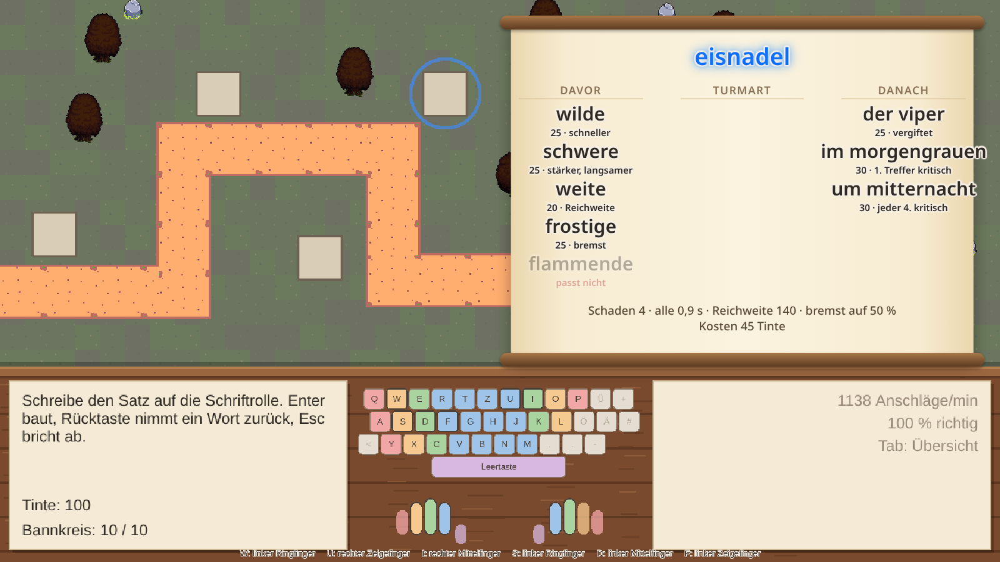
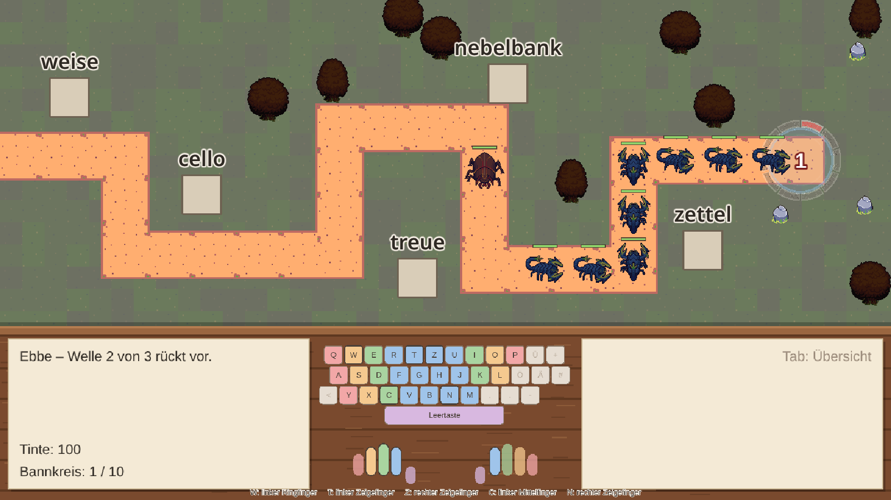

# typingame

Ein Tower-Defense-Spiel zum Lernen des **Zehnfingersystems** – auf Deutsch, für QWERTZ-Tastaturen.

In dieser Welt sind Worte Macht. Als Lehrling in einer Bibliothek lernst du die Tasten Reihe für Reihe; getippte Wörter bauen Türme, treffen Gegner und wirken Zauber. Als das *Verstummen* die Bibliothek niederbrennt, ziehst du über eine Weltkarte los und baust deine Türme aus ganzen Sätzen: *wilde jagd im morgengrauen*.



## Was das Spiel kann

- **Tutorial in der Bibliothek:** Grundreihe, obere und untere Reihe, Leertaste. Neue Tasten gibt es erst nach genug richtigen Anschlägen, nicht nach Zeit.
- **Lernhilfen:** Bildschirmtastatur mit Farben je Finger, der nächste Buchstabe und der passende Finger pulsieren. Wörter mit fehleranfälligen Tasten kommen häufiger. Statistik mit Anschlägen pro Minute, Genauigkeit und Fehlern je Taste.
- **Kämpfe:** Flut und Ebbe – in der Flut baut man in Ruhe, mit Enter rückt die nächste Welle an. Bauplätze, leuchtende Gegner und Zauber tragen Wörter; das Ziel wählt man über die ersten Buchstaben.
- **Reise über die Weltkarte:** Orte befreien, Türme aus Sätzen bauen und durch weitere Wörter stärken, neue Wörter in Fundstücken finden.
- **Fortschritt** wird lokal gespeichert.



Das Spiel ist in Entwicklung. Geplant sind weitere Gebiete mit Umlauten, Großschreibung, Satzzeichen, Ziffern und Sonderzeichen sowie Bosskämpfe mit ganzen Texten – siehe [Meilensteine](docs/game-design.md#9-meilensteine).

## Starten

Voraussetzungen:

- [Node.js](https://nodejs.org) ≥ 22 mit npm
- für das Desktop-Programm zusätzlich [Rust](https://rustup.rs) und die [Tauri-Voraussetzungen](https://v2.tauri.app/start/prerequisites/) (Fedora: siehe [`AGENTS.md`](AGENTS.md#voraussetzungen))

```sh
npm install        # einmalig
npm run dev        # im Browser unter http://localhost:1420
npm run desktop    # im eigenen Fenster (Tauri)
```

Weitere Befehle:

| Befehl | Zweck |
|---|---|
| `npm run check` | Typprüfung und Tests |
| `npm test` | nur Tests (Vitest) |
| `npm run build` | Web-Build nach `dist/` |
| `npm run desktop:build` | Desktop-Programm und Installationspakete nach `src-tauri/target/release/` |

## Technik

[Tauri 2](https://v2.tauri.app), [TypeScript](https://www.typescriptlang.org), [Phaser](https://phaser.io), [Vite](https://vite.dev). Die Spiellogik (Tipp-Engine, Kampf, Fortschritt) läuft ohne Phaser und ist mit [Vitest](https://vitest.dev) getestet; Inhalte wie Wörter, Level und Fundstücke liegen als Daten unter `src/content/`.

## Mitarbeiten

- [`docs/game-design.md`](docs/game-design.md) – was gebaut wird: Konzept, Regeln, Werte
- [`AGENTS.md`](AGENTS.md) – wie gearbeitet wird: Aufbau des Codes, Arbeitsablauf mit Issues, Branches und Pull Requests
- [Issues](https://github.com/TheRealKoller/typingame/issues) und [Project-Board](https://github.com/users/TheRealKoller/projects/9)

## Lizenz

Die Lizenz des Spiels ist noch nicht festgelegt ([#18](https://github.com/TheRealKoller/typingame/issues/18)). Die Grafik stammt überwiegend aus CC0-Paketen von Foozle; Quellen und Lizenzen stehen in [`src/assets/LICENSES.md`](src/assets/LICENSES.md).
